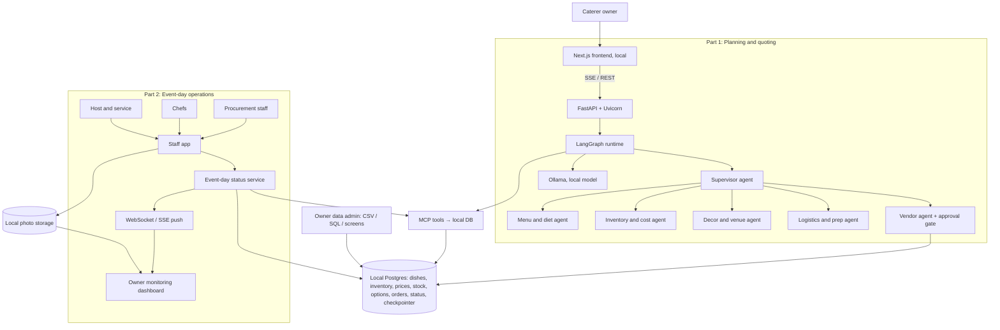
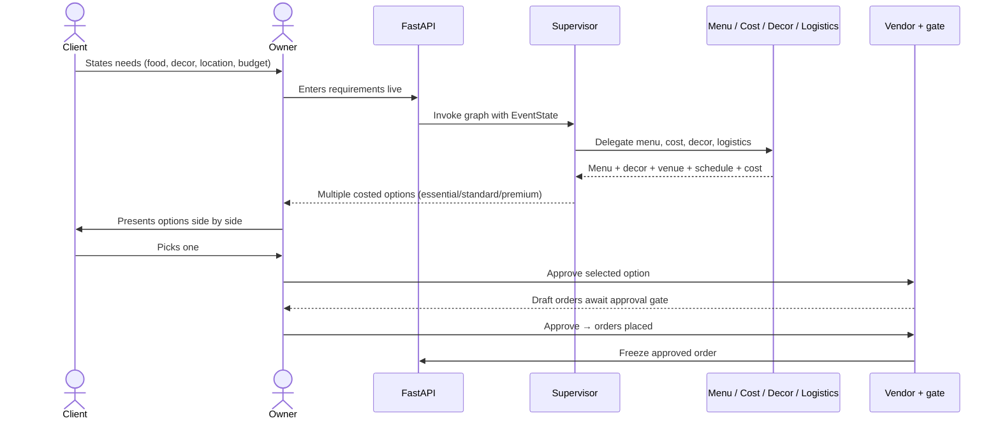
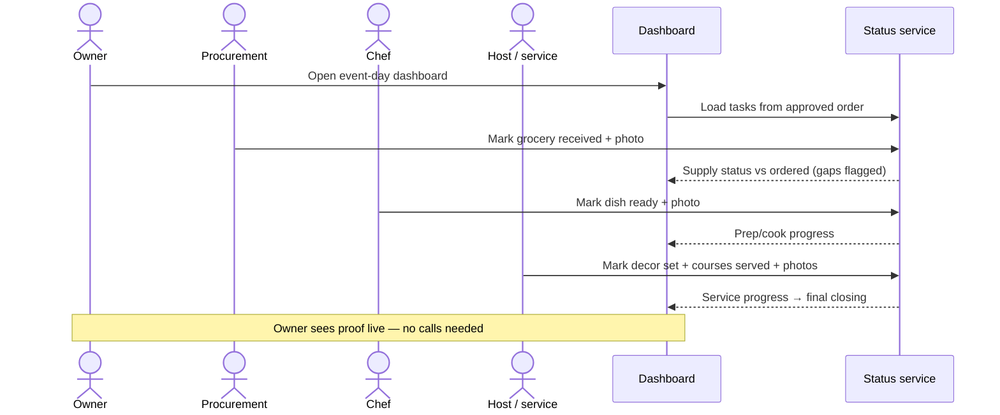
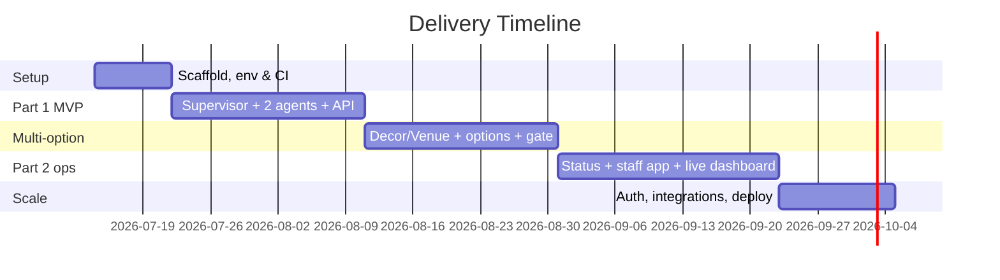

# Caterer System (LangGraph + Ollama) — Implementation Plan

> A two-part catering platform. Part 1 is a supervisor-orchestrated multi-agent **planning & quoting** assistant that turns a client's requirements (food, decor, location, budget) into multiple costed options. Part 2 is an **event-day operations** dashboard that monitors raw-material supply, inventory stock, and food service against the approved order through to final closing. An approved order in shared state is the hinge between them.

*Generated by idea2implement · 2026-07-08 · Rev 2 (two-part structure) · Status: Draft for review*

## 1. Overview & Goals

The system has two distinct parts, used at two different times by the caterer owner, joined by a single shared "approved order":

- **Part 1 — Planning & quoting (before the event).** The client discusses requirements with the caterer owner — food, decor, location, guest count, budget. The owner inputs these live during the meeting, and the system returns **multiple costed options** (e.g. essential / standard / premium tiers) the client can compare and pick from in the room. This part is agentic: a supervisor delegates to menu, cost, decor/venue, and logistics agents.
- **Part 2 — Event-day operations (on the day).** The owner opens a monitoring dashboard to track the **team's work** against the approved order. The team has three roles — procurement (collect/receive groceries), chefs (prep and cook), and host & service (decor, venue, serving) — and each member marks their tasks done with a **timestamped photo as proof**. The owner sees supply received, stock on hand, and service progressing course-by-course to **final closing**, all with visual confirmation, so they monitor instead of calling anyone. This part is mostly real-time operational software (task/status tracking + photo proof + alerts), not LLM generation, though an agent can summarize status and flag gaps.

- **Problem:** Catering event planning and execution are manual and fragmented. Quoting is slow — clients wait days for options — and a single monolithic prompt loses accuracy on constraints like allergies and budget. On the day, owners have no unified view of whether supplies arrived, stock is sufficient, and service is on track, so problems surface too late.
- **Target users:** Caterer owner/operator (primary user of both parts); the client is present during Part 1; kitchen and service staff feed status into Part 2.
- **Primary goals:**
  - Part 1: turn a live requirements conversation into several comparable, budget-compliant options within minutes.
  - Part 2: give the owner a real-time, single-screen view of supply, inventory, and service against the approved order.
- **Success metrics:**
  - ≥95% of generated options respect stated dietary constraints (measured against a labeled test set).
  - Every option stays within its stated budget tier or explicitly flags overage in 100% of runs.
  - p95 option-set generation < 30s on local Ollama (7–8B class model).
  - On event day, supply/inventory/service status reflects reality within a set refresh interval, and any shortfall vs the approved order is flagged, not missed.

## 2. Assumptions

- **Deployment — fully local, database-only:** the entire system runs on a single local machine. There are no external APIs, no ERP, and no cloud services. All data — dishes, recipes, inventory, prices, stock, options, orders, and event-day status — lives in one local database that the owner manages directly (admin screens, CSV import, or SQL). This is a firm constraint, not a phase.
- **Inference:** Local **Ollama** (e.g. Llama 3.1 8B or Qwen2.5) on the same machine; no per-token cloud bill and no data leaving the box. A capable CPU works; a GPU makes it faster.
- **Budget tier:** Lean. Self-hosted, open-source only; effectively zero recurring SaaS cost.
- **Team:** 1–2 engineers (Python/LLM familiarity), part-time PM. Confidence therefore **Medium**.
- **Inventory & suppliers:** managed as local database tables, not integrations. "Placing an order" records an order row and produces a printable/exportable shopping list the owner acts on manually; there is no supplier API. Stock levels are updated by the owner/staff in the app, not synced from anywhere.
- **Compliance:** Because nothing leaves the machine, data privacy is inherent. No PII beyond client contact + event details; allergen accuracy remains a hard, safety-critical requirement.
- **State persistence:** Options, the approved order, event-day status, and conversation state all persist in the local database (LangGraph checkpointer + relational tables).
- **Scope of decor/location:** first-class alongside food — options include decor and venue choices with their own costs, priced from local catalog tables (no external venue marketplace).
- **Event-day status input:** supply deliveries, stock, and service progress are updated by staff in-app (check-off + photo); no external feeds.
- **Part 2 is mostly non-agentic:** the event-day dashboard is real-time operational software reading local status against the approved order; an LLM is optional there.
- **No multi-tenant billing / no external connectors** in scope.

## 3. Requirements

**Functional — Part 1: Planning & quoting**
- Capture event requirements the owner enters live during the client meeting: guest count, event type, budget, dietary restrictions, decor preferences, location, date.
- **Supervisor agent** parses the requirements and routes to specialized workers.
- **Menu & Diet agent** designs themed menus honoring dietary restrictions and guest count.
- **Inventory & Cost agent** computes ingredient quantities, prices against inventory, checks the budget, and emits a shopping list per option.
- **Decor & Venue agent** proposes decor packages and location fit from a catalog, with their own costs.
- **Logistics & Prep agent** schedules prep times, delivery handoffs, and equipment rentals for each option.
- Supervisor aggregates workers into **multiple costed options** (e.g. essential / standard / premium), each with menu + decor + venue + schedule + total cost, and returns them for side-by-side comparison.
- Client selects one option; the system freezes it into an **approved order** (menu, quantities, decor/equipment, chosen vendors, budget).
- **Vendor agent** drafts supplier orders for the approved order and places them only after a **human approval gate**.
- Persist option sets, the approved order, and conversation state per session; support resume.

**Functional — Part 2: Event-day operations**
- Load the **approved order** as the baseline to monitor against.
- **Team roles & task tracking:** the owner's team is modeled as three roles, each with tasks derived from the approved order — **procurement** (1–2 people: collect from market / receive supplier deliveries), **chefs** (2–3 people: prep and cook each dish), and **host & service** (1–2 people: decor, venue management, serving to closing). Each member sees their assigned tasks and marks them in progress/done.
- **Photo proof of work:** completing a task requires (or strongly prompts for) a **timestamped photo** — items received, dish ready, decor set up, station serving — so the owner has visual confirmation without calling anyone.
- **Raw-material supply tracking:** procurement's received deliveries are shown vs quantities ordered; shortfalls/late deliveries flagged.
- **Inventory stock tracking:** on-hand levels for decor, equipment, and non-food items vs what the chosen package requires.
- **Service progress tracking:** host/service tasks track courses/stations served through to **final closing**, with a clear completion state.
- **Owner status dashboard:** a live single-screen view showing each role's progress and proof photos, with delays/gaps flagged automatically; optional LLM-generated status summary/alerts. The explicit goal is that the owner monitors instead of phoning the team.
- **Staff surface:** a lightweight mobile view per team member — their task list, one-tap status update, and camera/photo upload.
- Real-time updates (websocket/SSE) as staff actions or inventory events change status.

**Shared**
- Expose Part 1 as a FastAPI service with a session-based conversational endpoint (SSE streaming for option generation) and Part 2 as a status API with real-time push.

**Non-functional**
| Attribute | Target |
|---|---|
| Scale | ~50 concurrent planning sessions; event-day dashboards for concurrent live events |
| Availability | 99% (single-region internal tool); Part 2 must stay available for the duration of a live event |
| Security/Compliance | Local inference for data privacy; secrets outside repo; allergen constraint accuracy treated as safety-critical |
| Performance | p95 option-set generation < 30s on local 8B model; supervisor routing < 2s; event-day status refresh within seconds |

## 4. Technology Stack

| Layer | Choice | Why it fits | Alternative |
|---|---|---|---|
| Orchestration | **LangGraph** | Stateful graph of supervisor + worker nodes, typed `EventState`, built-in checkpointing and handoff/routing primitives — exactly the multi-agent pattern required | CrewAI / AutoGen |
| LLM inference | **Ollama** (Llama 3.1 8B / Qwen2.5) | Local, no per-token cost, keeps client event data private; good enough for structured planning with tool calls | vLLM self-host · cloud (Claude/OpenAI) for hard cases |
| Tool protocol | **MCP (Model Context Protocol)** | Clean, typed boundary between agents and data; here every tool points at the local database. Keeps agents free of raw SQL and gives one place for validation — no external systems to connect | Native LangChain/Python tools calling the DB directly |
| Backend / API | **FastAPI + Uvicorn** | Async, first-class streaming (SSE), Pydantic models mirror `EventState`, minimal boilerplate to expose the graph as a service | Litestar · Flask |
| Database | **PostgreSQL (local)** | Single local source of truth: dishes/recipes, inventory, prices, stock, options, orders, event-day status, and the LangGraph checkpointer — all in one DB on the machine | SQLite (even simpler, single-file) |
| Photo proof storage | **Local disk / local MinIO** | Proof photos stored on the same machine; metadata rows in Postgres point at file paths or a local MinIO bucket. Nothing leaves the box | Bytea in Postgres (simplest, small scale) |
| Real-time (Part 2) | **WebSockets / SSE** (FastAPI) | Push live task/supply/service status and new proof photos to the owner's dashboard; a single local process can fan out without external infra | Polling (simplest) |
| Cache/queue | **Redis (local) or in-process** | Optional — session/rate limiting and status pub/sub. At this scale an in-process approach avoids even running Redis | In-process (no Redis) |
| Frontend | **Next.js (React) + Tailwind**, served locally | Two surfaces: chat-style planning UI with streaming option cards (Part 1) and a live event-day monitoring dashboard (Part 2) | SvelteKit · plain React · plain HTML |
| Data admin | **Simple admin screens + CSV/SQL import** | Since inventory/dishes aren't synced from anywhere, the owner edits them directly — seed and maintain tables via a small admin UI or CSV import | Adminer / pgAdmin for raw table editing |
| Infra / Hosting | **Docker Compose on the local machine** | One `docker compose up` brings up Ollama, Postgres, API, and frontend together; fully reproducible, runs offline | Native install (no Docker) |
| Observability | **Local logs + Langfuse (self-host) optional** | Per-node agent traces help debugging; a self-hosted/local tracer keeps data on the machine. Plain structured logs are enough to start | File logs only |

## 5. Architecture

The two parts share one local database and an approved-order record but have different runtime shapes: Part 1 is the LangGraph agent graph; Part 2 is a real-time status service. Everything below runs on a single local machine — no external APIs, no ERP, no cloud.

**Part 1** hands each owner turn to the LangGraph runtime, which maintains a typed `EventState`. The Supervisor routes to worker nodes — menu, cost, decor/venue, logistics — and assembles their outputs into several costed options. When the client picks one, the Vendor agent drafts orders and pauses at a human approval gate; approving records the order rows and produces a shopping list the owner acts on manually (there is no supplier API). Every worker reaches data only through the MCP tool layer, and each tool reads/writes the local Postgres — there are no external systems behind the tools.

**Part 2** reads the approved order as its baseline and runs as a real-time status service. The team — procurement, chefs, host/service — works from a lightweight app showing each member their assigned tasks; marking a task done captures a timestamped photo saved to local storage. Those actions update supply, stock, and service status in the local DB, and changes are pushed over WebSocket/SSE to the owner's dashboard so the owner sees visual confirmation live rather than calling. It shares the same local Postgres as Part 1 but does not run the agent graph. Because inventory and dishes aren't synced from anywhere, the owner seeds and maintains those tables directly through simple admin screens, CSV import, or SQL.

## 6. Key User Flows

**Part 1 — Planning conversation → costed options → approved order**

**Part 2 — Event day: team tracks tasks with photo proof; owner monitors**

## 7. Data Model

Part 1 produces several `OPTION` rows per event; the client picks one, which becomes the `APPROVED_ORDER`. Part 2's tracking tables reference that approved order as their baseline: supply and service status roll up from `TASK` records, each assigned to a `TEAM_MEMBER` (in a procurement / chef / host role) and each carrying one or more `PHOTO_PROOF` uploads.

```mermaid
erDiagram
    EVENT ||--|| EVENT_STATE : has
    EVENT ||--|{ OPTION : offers
    OPTION ||--|{ MENU_ITEM : includes
    OPTION ||--o{ DECOR_ITEM : includes
    OPTION }o--o| VENUE : uses
    MENU_ITEM ||--|{ INGREDIENT_LINE : requires
    INGREDIENT_LINE }o--|| INVENTORY_ITEM : draws_from
    EVENT ||--o| APPROVED_ORDER : freezes
    OPTION ||--o| APPROVED_ORDER : chosen_as
    APPROVED_ORDER ||--o{ VENDOR_ORDER : generates
    APPROVED_ORDER ||--o{ TASK : tracked_by
    TEAM_MEMBER ||--o{ TASK : assigned
    TASK ||--o{ PHOTO_PROOF : has
    VENDOR_ORDER ||--|{ ORDER_LINE : contains
    EVENT {
      uuid id
      string event_type
      int guest_count
      decimal budget
      date event_date
    }
    APPROVED_ORDER {
      uuid id
      uuid option_id
      string status
      decimal total
      timestamp approved_at
    }
    TEAM_MEMBER {
      uuid id
      string name
      string role
      string phone
    }
    TASK {
      uuid id
      string category
      string title
      string status
      decimal qty_expected
      decimal qty_actual
      timestamp completed_at
    }
    PHOTO_PROOF {
      uuid id
      uuid task_id
      string object_key
      timestamp taken_at
    }
```

`TASK.category` distinguishes the tracked streams (supply / prep-cook / decor / service); `role` on `TEAM_MEMBER` is one of procurement, chef, or host. Supply and service dashboards are views over these tasks — e.g. "supply received vs ordered" is the set of supply-category tasks with their `qty_actual` against `qty_expected`.

## 8. Implementation Roadmap

| Phase | Scope | Duration | Key deliverables |
|---|---|---|---|
| Phase 0 — Setup | Repo, Docker Compose (Ollama + Postgres + Redis), CI, `EventState` + options/order schema, LangGraph skeleton | ~1.5 wks | Reproducible dev env, green CI, one-node graph runs end to end |
| Phase 1 — Part 1 MVP | Supervisor + Menu/Diet + Inventory/Cost agents, budget & allergen logic, single-option output, FastAPI streaming, minimal chat UI, checkpointer | ~4 wks | Requirements → one costed, constraint-respecting option |
| Phase 2 — Multi-option planning | Decor/Venue + Logistics agents, tiered option generation (essential/standard/premium), option comparison UI, approved-order freeze, Vendor agent + human approval gate, MCP tool layer, eval harness | ~4 wks | Requirements → multiple costed options → approved order |
| Phase 3 — Part 2 event-day ops | Status service + team/task model from approved order, staff mobile app (task list, one-tap status, photo capture/upload), object storage, real-time WebSocket/SSE owner dashboard with proof gallery + gap alerts | ~4.5 wks | Team tracks tasks with photo proof; owner monitors live through final closing without calling |
| Phase 4 — Hardening/Scale | Auth, real inventory/supplier wiring, Sentry, LangSmith tracing, load testing, k8s/managed deploy, prompt/model tuning | ~2.5 wks | Production deploy, observability, SLAs met |

## 9. Effort Estimation

Basis: **T-shirt sizing** mapped to person-days, cross-checked against the reference anchors. Confidence: **Medium** (LangGraph multi-agent orchestration and prompt tuning carry irreducible uncertainty). Includes ~20% integration buffer; QA itemized separately.

| Workstream | Effort (person-days) | Notes |
|---|---|---|
| LangGraph orchestration (supervisor + routing + state/checkpointer) | 12 | Core risk area; handoffs + resumable state |
| Agent logic: Menu&Diet, Inventory&Cost | 10 | Budget math + allergen constraint enforcement |
| Agent logic: Decor&Venue, Logistics&Prep | 8 | Catalog pricing, venue fit, scheduling |
| Multi-option generation + comparison + approved-order freeze | 7 | Tiering, side-by-side, selection → frozen order |
| Vendor agent + human approval gate | 4 | Draft orders, gated placement |
| Part 2: status service + team/task/tracking model | 10 | Tasks from approved order; supply/service views; roles |
| Part 2: staff mobile app (task list, status, photo capture/upload) | 8 | Per-role views, presigned photo uploads |
| Part 2: real-time owner dashboard (WebSocket/SSE + Redis + proof gallery) | 10 | Live push, gap alerts, per-role progress + photos |
| MCP tool layer over the local DB (recipe, diet, price, stock) | 6 | Typed tools against local Postgres; no external connectors |
| Local data admin + seeding (dishes, inventory, prices) | 5 | Admin screens / CSV import; careful allergen tagging |
| FastAPI service + SSE streaming (Part 1) | 6 | Session endpoints, Pydantic models |
| Frontend (Next.js planning chat + option cards) | 8 | Streaming option UI |
| Infra/DevOps (Docker Compose, local Ollama, backups) | 6 | Single-machine local setup; no cloud/k8s |
| Eval harness + QA/testing | 9 | Allergen/budget accuracy set + event-day flows |
| Observability (local logs / optional local tracer) | 2 | No managed SaaS to wire |
| PM/coordination | 5 | 2-person team overhead across two parts |
| **Total** | **~116 person-days** | Planning estimate, not a fixed quote. Range **100–135 pd** |

## 10. Cost Estimation

**One-time build cost** (effort × blended rate; default $80/hr — adjust to your team):

| Item | Amount |
|---|---|
| Total effort | 100–135 person-days = 800–1,080 hours |
| Blended rate | $80/hr (adjustable — offshore ~$25–50, US mid ~$75–125) |
| **Estimated build cost** | **~$64,000 – $86,400** at $80/hr |

*At an offshore ~$40/hr blended rate this is roughly **$32,000 – $43,200**; at US-senior ~$150/hr, ~$120,000 – $162,000. Going fully local trades away integration effort and recurring cost for local data-admin, seeding, and backup work. The build cost is dominated by the two-part app scope, not infrastructure.*

**Recurring monthly cost:**

Because everything runs locally with no external APIs, ERP, or cloud services, there is effectively no recurring SaaS/infrastructure bill. The only ongoing costs are the machine's electricity and its eventual amortized hardware/upgrade.

| Item | Low | Expected | High |
|---|---|---|---|
| Cloud / SaaS / API fees | $0 | $0 | $0 |
| Local machine electricity (running Ollama + services) | $0 (existing box) | $10 | $40 |
| One-time hardware (if a better CPU/GPU is bought) | $0 | (capex, not monthly) | — |
| **Monthly total** | **~$0** | **~$10** | **~$40** |

> The fully-local, database-only design removes essentially all recurring cost — no per-token LLM fees (Ollama is local), no managed Postgres (local instance), no object-storage or auth SaaS. The trade-offs move to the machine itself: it must be adequately specced for the model, and the owner is responsible for local backups of the database and photo files (see risks).

## 11. Risks & Mitigations

| Risk | Likelihood | Impact | Mitigation |
|---|---|---|---|
| Allergen/dietary constraint violated in output | M | **H** (safety) | Deterministic post-check on menu against diet flags; block/flag violations; eval test set gates releases |
| Local model too weak for reliable structured planning | M | H | Prompt engineering + tool-enforced math (the model proposes, tools decide); pick the strongest model the machine can run; keep humans reviewing options before approval |
| Multi-agent loops / non-termination | M | M | Recursion limits + step caps in LangGraph; supervisor stop conditions; local tracing |
| Budget math done "in the LLM" and wrong | M | H | Move all arithmetic to deterministic tools (Inventory&Cost agent computes against the local DB, not free-form generation) |
| Local inventory data goes stale / inaccurate (no external sync) | M | H | Easy admin editing + CSV import; show "stock last updated"; deduct stock when orders are recorded; periodic owner review prompt |
| No off-site backup — disk failure loses all data | M | **H** | Automated local DB + photo-file backups to an external drive or a location the owner controls; documented restore steps; this is the main reliability cost of going fully local |
| Single machine down = whole system down (no redundancy) | L | M | Keep services simple and restartable via `docker compose`; document a cold-start; acceptable for single-operator use |
| Machine under-specced for the model | M | M | Choose model size to fit hardware (7–8B or smaller quantized); GPU optional but recommended; measure latency early |
| Team doesn't update tasks / skips photos, so the board is stale | M | H | One-tap updates with in-flow camera; make the photo the fast path; show "last updated" per role; alert owner when a task is overdue |
| Poor connectivity at venue blocks photo capture | M | M | App works on the local network/machine; queue photos and retry; owner sees "pending" state |
| Proof photos raise privacy/storage concerns | L | M | Files stay on the local machine; restrict access to owner + assignee; retention policy; photos are of food/setup/deliveries, not faces |
| Event-day dashboard unavailable during a live event | L | H | Part 2 kept simple and separately restartable so it stays up even if Part 1/LLM is down; approved order cached locally |
| Two-part scope stretches a 1–2 person team | M | M | Phased delivery — ship Part 1 planning value before building Part 2; Part 2 is non-agentic and can be sequenced independently |
| Scope creep into multi-tenant billing/public product | M | M | Explicitly out of scope for build; revisit post-pilot |

## 12. Next Steps

1. Confirm the machine's specs and pick the largest model it can comfortably run (e.g. Llama 3.1 8B or a quantized variant); stand up Ollama + local Postgres via Docker Compose.
2. Define the local schema — dishes/recipes, inventory, prices, stock, options, approved order, event-day status — and seed inventory + a starter dish catalog via CSV/SQL. This seeding is real work and the allergen tagging must be careful.
3. Build the LangGraph skeleton with a supervisor + one worker whose MCP tool reads the local dish table, and confirm a round-trip end to end.
4. Build Part 1 first — Menu&Diet + Inventory&Cost agents against the local DB and the FastAPI streaming endpoint — and demo a single costed option before adding decor/venue and tiered options.
5. Set up automated local backups of the database and photo files from day one (external drive or owner-controlled location) — with no cloud, this is the primary safeguard against data loss.
6. Sequence Part 2 after Part 1 delivers value; design the approved-order record early since it is the contract between the two parts.
6. Set a GitHub token (`GITHUB_TOKEN`) if you want this plan published to the repo.
